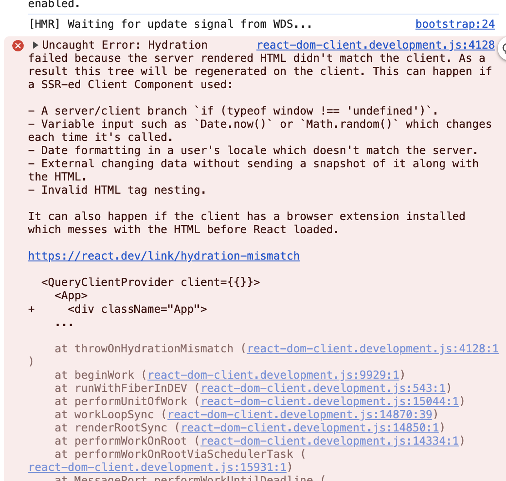

# Application Name

## Description

Application Name is a web application designed to provide users with detailed information about words, including their phonetics, meanings, and source URLs. This application fetches data from an external API and displays it in a user-friendly interface.

## Features

- **Word Search**: Users can search for any word to get detailed information.
- **Phonetics**: Displays the phonetic transcription of the word.
- **Meanings**: Provides multiple meanings and parts of speech for the word.
- **Source URLs**: Links to the sources of the word definitions.

## Installation

1. Clone the repository:

   git clone `url to be added after repo creation`

2. Navigate to the project directory

3. Install dependencies:

   `npm install` && run `npm run dev` to start the server

4. Open your browser and navigate to `http://localhost:3000`.

## test

- To run the tests: `npm run test`
- To run the test with coverage report: `npm run test:coverage`

### Technologies and Concepts

### Form Action

Form actions in React handle form submissions, process user input, and send it to an API endpoint. They simplify managing form state, validation, and submission, ensuring better handling of user input and integration with backend systems.

### React Query

React Query is a powerful library for fetching, caching, and updating asynchronous data in React applications. It abstracts data-fetching logic, simplifies handling loading states, and ensures synchronization with the server, improving performance and reliability.

### Server-Side Rendering (SSR)

Server-Side Rendering (SSR) generates HTML on the server instead of the client, improving performance and SEO by providing fully rendered pages to the client. In this project, SSR is implemented using Express, a minimal Node.js web application framework.

### Webpack

Webpack is a module bundler that optimizes the build process by bundling JavaScript, managing assets, and enabling features like hot module replacement. It helps improve performance by reducing bundle size and optimizing the loading of resources.

### Jest

Jest is a JavaScript testing framework used for unit and integration testing. It simplifies testing with zero configuration, snapshot testing, and a powerful mocking library, ensuring the correctness of the codebase and detecting regressions.

### Other Technologies Used

- **React**: A JavaScript library for building user interfaces, enabling reusable components and efficient state management.
- **ReactDOM**: Handles DOM-specific methods for efficient rendering of React components.
- **React StrictMode**: Activates additional checks and warnings to highlight potential problems in the application.
- **@tanstack/react-query-devtools**: A set of debugging tools for React Query, making it easier to track and optimize queries.

### Improvements to be Made:

- I encountered a hydration error during SSR (Server-Side Rendering) in console.
- Not sure if a browser extension is causing the issue, but I’m hoping to find a solution.
- While SSR improves performance and is better for SEO, it does have some caveats.
- If it weren’t for this error, I would be able to proceed with writing Cypress tests or improving the application with E2E tests to ensure proper functionality.
  
